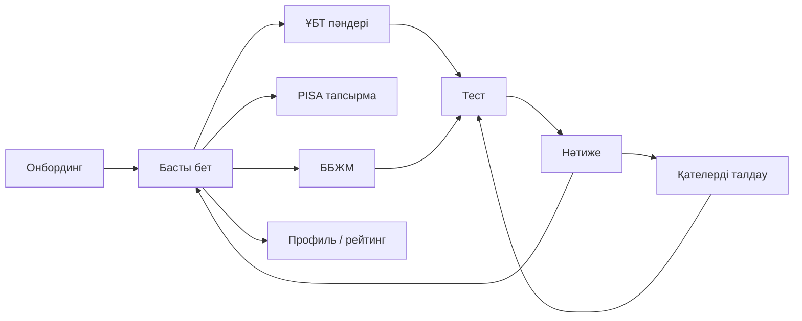

# Білім — әзірлеуге арналған спецификация

2026-09-24 · Саят Айтбаев

Түпнұсқа құжат: https://claude.ai/code/artifact/41d0969a-7430-4fa2-bde8-006912e574d6
Дизайн полотносы: https://claude.ai/artifact/No8MKtNTAEptLdTBkqsW3y

## Шолу

«Білім» — ҰБТ 2027, PISA және ББЖМ (МОДО) дайындығына арналған мобильді-бірінші веб-қосымша. Бірінші нұсқаға 12 экран кіреді.

| Экран | Файл | Өлшемі, px | Интерактив |
| --- | --- | --- | --- |
| Басты бет (десктоп) | Main.dc.html | 1280 × 820 | Hover күйлері |
| Басты бет (мобильді) | Mobile.dc.html | 390 × 844 | Режимдерге сілтемелер |
| ҰБТ 2027 · пәндер | Unt.dc.html | 390 × 844 | Бейіндік пәндер жұбын таңдау |
| ҰБТ · тест | Test.dc.html | 390 × 844 | Таңдау, тексеру, таймер, белгілеу |
| ҰБТ · нәтиже | Result.dc.html | 390 × 844 | Статикалық |
| Қателерді талдау | Review.dc.html | 390 × 844 | Сүзгі, ашылатын карточка, қайталау тізімі |
| PISA · тапсырма | Pisa.dc.html | 390 × 844 | Табтар, диаграмма бағаны, жауап |
| ББЖМ (МОДО) | Modo.dc.html | 390 × 844 | 4 / 9-сынып ауыстырғышы |
| Профиль · рейтинг | Profile.dc.html | 390 × 844 | Сынып / мектеп / қала табы |
| Онбординг | Onboarding.dc.html | 390 × 844 | 4 қадам |
| Шеткі күйлер | States.dc.html | 1740 × 900 | Жүктелу, бос, желісіз, уақыт бітті |
| Дизайн жүйесі | System.dc.html | 1200 × 1260 | Анықтама |

Экрандардағы есімдер, ұпайлар, пайыздар мен тест сұрақтары — мысал деректер. Олар API-ден немесе сұрақтар банкінен келуі керек.

## Дизайн токендері

Токендер `design/tokens.css` пен `design/tokens.json` файлдарында. Акцент түстері тек прогресс пен белсенді күйлерге қолданылады.

| Токен | Мәні | Қолданылуы |
| --- | --- | --- |
| --bg | #FFFFFF | Фон, карточкалар |
| --neutral | #F3F4F6 | Блоктар, пиллдер, қосымша батырма |
| --border | #E5E7EB | Карточка шекарасы 1 px |
| --text | #111827 | Негізгі мәтін, негізгі батырма фоны |
| --text-2 | #4B5563 | Қосымша мәтін (сұр фонда да 4.5:1) |
| --accent | #2563EB | Прогресс, таңдалған күй, белсенді мәзір |
| --accent-2 | #7C3AED | Екінші прогресс, ұпай белгісі |
| --tint-blue / --tint-violet | #EFF6FF / #F5F3FF | 3D аймақтары, тегтер |
| --success / --danger | #059669 / #DC2626 | Дұрыс / қате жауап |
| --streak | #EA580C | Серия (от) белгісі |

Прогресс градиенті: `linear-gradient(90deg, var(--accent), var(--accent-2))` — тек жолақтар мен сақиналарға.

**Типография** — Onest (Google Fonts, 400–800), қазақ әріптерін қолдайтын cyrillic-ext жиыны.

| Стиль | Өлшем / салмақ | Letter-spacing |
| --- | --- | --- |
| Display | 40 / 800 | −1.2 px |
| H1 | 26 / 800 | −0.6 px |
| H2 | 20 / 800 | −0.3 px |
| Body | 15 / 500 | 0 |
| Caption | 13 / 500 | 0 |
| Label | 12 / 700 | 0 |

**Радиус:** 10 тег · 14–16 батырма және жауап нұсқасы · 20 блок · 24–28 карточка · 50% аватар.

**Аралық (4 px торы):** 4, 8, 12, 16, 20, 24, 40. Мобильді шеткі өріс 20 px, десктоп 40 px, карточкалар арасы 12 / 24 px.

## Компоненттер мен күйлер

Барлық басылатын элементтердің биіктігі мен ені кемінде 44 px болуы керек.

| Компонент | Өлшемі | Күйлері | HTML |
| --- | --- | --- | --- |
| Негізгі батырма | биіктігі 48–52, радиус 15–16 | default #111827 · hover #1F2937 · disabled #9CA3AF · focus 2 px көк outline | `button` / экран ауысса `a` |
| Қосымша батырма | 48–52 | фон #F3F4F6 · hover #E5E7EB | `a` / `button` |
| Иконка-батырма | 44 × 44, дөңгелек | default · hover | `button` + `aria-label` |
| Пилл (серия, ұпай, таймер) | биіктігі 36–40 | статикалық | `div` + `aria-label` |
| Жауап нұсқасы | биіктігі ≥ 56, шекара 1.5 px | бастапқы · таңдалған (көк) · дұрыс (жасыл + «Дұрыс») · қате (қызыл + «Қате») | `role=radiogroup` ішінде `button role=radio` |
| Сегментті таб | биіктігі 40, сұр трек | белсенді = ақ фон + жұмсақ көлеңке | `role=tablist` / `tab` + `aria-selected` |
| Прогресс жолағы | биіктігі 6–8 | толу 0–100% | `role=progressbar` + `aria-valuenow` |
| Сегментті прогресс | 5 немесе 10 бөлік | орындалды · ағымдағы · бос | сол |
| Сақина | 56–112, штрих 5–6 | пайыз ортада | SVG + мәтін |
| Режим карточкасы | радиус 24–28, 1 px шекара | hover: шекара #C7D2FE, көлеңке, −2 px көтеру | `article` + ішінде сілтеме |
| Ашылатын карточка | радиус 20 | жабық · ашық | `button aria-expanded` |
| 3D тегі | биіктігі 22–26, үзік шекара | статикалық | `span` |

Дұрыс/қате күйі тек түспен емес, мәтін белгісімен де көрсетіледі.

## Экрандар және навигация

Негізгі сценарий: онбординг → басты бет → ҰБТ пәндері → тест → нәтиже → қателерді талдау.

Төменгі мәзір (Басты, Сабақтар, Рейтинг, Профиль) басты бет пен профильде көрінеді; ішкі экрандарда «Артқа» батырмасы бар.

Ұсынылатын маршруттар: `/onboarding`, `/`, `/unt`, `/unt/test/:id`, `/unt/result/:id`, `/unt/review/:id`, `/pisa/:unitId`, `/modo`, `/profile`.

**Басты бет.** Жоғарғы панель: аватар (→ профиль), серия, жалпы ұпай. «Бүгінгі мақсат» карточкасы күнделікті мақсатқа (3 / 5 / 8 тапсырма) есептеледі. Үш режим карточкасында прогресс пен 3D аймағы бар.

**ҰБТ пәндері.** 3 міндетті пән және бейіндік жұпты таңдау (горизонталь чиптер). Таңдау төмендегі екі жолды жаңартады және профильде сақталады.

**Тест.** Күйлер реті: нұсқа таңдалмаған («Тексеру» өшірулі) → таңдалды → тексерілді (кері байланыс + түсіндірме) → келесі сұрақ немесе нәтиже. Таймер сервер уақытынан есептеледі. Кері байланыс тек «Жаттығу режимінде»; сынақ ҰБТ-да жауаптар соңында көрсетіледі. Сұрақты «Белгілеу» мүмкін.

**Нәтиже.** Жалпы балл / 140, шекті баллмен салыстыру, пәндер бойынша жолақтар, қайталау керек тақырыптар, алынған ұпай, «Қателерді талдау» батырмасы.

**Қателерді талдау.** Сүзгі: Барлығы / Қате / Белгіленген. Әр сұрақ ашылатын карточка: сіздің жауап, дұрыс жауап, түсіндірме, «Ұқсас тапсырма» және «Қайталауға». Қайталау тізімі келесі күннің мақсатына қосылады.

**PISA.** Сауаттылық табтары (Математика / Оқу / Жаратылыстану), интерактивті стимул (диаграмма бағанын басу), төрт нұсқалы сұрақ.

**ББЖМ.** 4 / 9-сынып ауыстырғышы, үш бағыт бойынша диагностика диаграммасы және бағыттар тізімі.

**Профиль.** Серия, ұпай, орын; 4 апталық белсенділік картасы (4 деңгей); сынып / мектеп / қала рейтингі, оған дейін пайдаланушының жолы бөлектеледі.

**Онбординг (4 қадам).** Қош келдіңіз → сынып (4–11) → бейіндік пәндер жұбы → күнделікті мақсат. 10-сыныптан төмен болса, пән таңдау қадамы өткізіледі. Соңғы қадамда ұсынылатын режим: 4 және 9-сынып → ББЖМ, 10–11 → ҰБТ 2027, қалғаны → PISA. «Өткізу» кез келген қадамда басты бетке апарады.

**Шеткі күйлер.**

| Күй | Қашан | Мінез-құлқы |
| --- | --- | --- |
| Жүктелу | Дерек 300 мс-тан ұзақ келсе | Нақты орналасуды қайталайтын скелет, жарқыл анимациясы (reduced motion кезінде статикалық) |
| Бос | Жаңа пайдаланушы, тест тапсырмаған | Серия 0 (сұр от), сурет, «Диагностиканы бастау» |
| Желісіз | Тест кезінде байланыс үзілсе | Қара баннер `role=status`, сақталған жауап саны; тест тоқтамайды |
| Уақыт бітті | Таймер 0-ге жетсе | Төменгі парақ (`role=dialog`), жауап берілген сұрақ саны, «Нәтижені көру» |

## 3D элементтер мен анимация

Макеттегі SVG суреттер — орын ұстағыштар; өнімде олардың орнына Three.js (WebGL) сахналары қойылады. Жұмыс істейтін үлгі: `prototype/bilim-3d.html`.

| Карточка | Сахна | Интеракция |
| --- | --- | --- |
| ҰБТ 2027 | Қалқып тұрған куб, шар, тор, пирамида | Сүйреп айналдыру |
| PISA | Атом: ядро + 3 орбита | Атомды басу — электрондар жылдамдайды |
| ББЖМ | 3D бағанды диаграмма | Бағанды басу — мәні көрсетіледі |

- Фон мөлдір (alpha), жарық: ambient + бір directional; материал MeshStandard, түстер токеннен.
- Canvas тек карточка көрінгенде рендерленеді (IntersectionObserver).
- devicePixelRatio ең көбі 2; өнімде бір WebGL renderer + scissor ұсынылады.
- WebGL жоқ немесе төмен қуатты құрылғы → макеттегі SVG суреттер қалады.
- Қалқу анимациясы: translateY 0 → −10 px, 4–6 с, ease-in-out, элементтер арасында кешігу 1.6 с. Атом орбитасы: 14 с толық айналым.
- `prefers-reduced-motion: reduce` → барлық автоматты анимация тоқтайды, сүйреу қалады.

## Адаптив, қолжетімділік, шеткі жағдайлар

| Ені, px | Орналасу |
| --- | --- |
| < 600 | Мобильді: ҰБТ кең карточка, PISA мен ББЖМ 2 бағанда; төменгі мәзір |
| 600–1023 | Планшет: барлық режим 2 бағанда, төменгі мәзір |
| ≥ 1024 | Десктоп: 3 баған, жоғарғы мәзір, контент ені ең көбі 1200 |

**Қолжетімділік (WCAG 2.1 AA).**

- Мәтін контрасты ≥ 4.5:1; сұр фондағы қосымша мәтін — #4B5563.
- Барлық басылатын элемент — нағыз `button` немесе `a`, басу аймағы ≥ 44 px, көрінетін focus outline.
- Иконка-батырмаларда `aria-label`; таймер секунд сайын экран оқушыға хабарламайды (тек 10 / 5 / 1 мин қалғанда `aria-live=polite`).
- `lang="kk"`; тест пернетақтамен толық басқарылады (1–4 → A–D, Enter → тексеру).

**Шеткі жағдайлар.**

- Желі жоқ: тест жауаптары жергілікті сақталып, желі қайта келгенде жіберіледі.
- Уақыт бітті: тест автоматты аяқталып, нәтижеге өтеді; жауапсыз сұрақтар 0 балл.
- Жаңа пайдаланушы: серия 0, прогресс 0%, бейіндік пәндер таңдалмаған — «Пәндерді таңдаңыз» түймесі.
- Ұзын есімдер мен үлкен сандар: бір жол, соңы «…», сандар бос орынмен бөлінеді (2 450).

## Мазмұн деректері

ҰБТ экраны 2026 жылғы ресми форматқа негізделген: 120 сұрақ, 140 балл, 240 минут. 2027–2029 жылдары жаңа формат пилоттық режимде енгізіледі, сондықтан сандар конфигтен келуі керек.

| Пән | Сұрақ | Макс. балл | Түрі |
| --- | --- | --- | --- |
| Қазақстан тарихы | 20 | 20 | Міндетті |
| Оқу сауаттылығы | 10 | 10 | Міндетті |
| Математикалық сауаттылық | 10 | 10 | Міндетті |
| Бейіндік пән 1 | 40 | 50 | Таңдау бойынша |
| Бейіндік пән 2 | 40 | 50 | Таңдау бойынша |

- Шекті балл (2026): ұлттық ЖОО — 65, басқа ЖОО — 50, педагогика мен құқық — 75, денсаулық — 70. Пән бойынша ең азы: тарих пен бейіндік пәндер 5, сауаттылық 3.
- ББЖМ (МОДО) — 4 және 9-сыныпта математикалық, жаратылыстану және оқу сауаттылығын тексереді.
- PISA тренажері үш сауаттылық бағытын қамтиды: математика, оқу, жаратылыстану.
- Макеттегі тест сұрақтары мен бірлік тізімі (5 / 13, 3 / 14) — мысал; нақты банк әдіскерлермен жасалады.

**Дереккөздер**

- [Tengrinews: негізгі ҰБТ форматы мен шекті баллдар](https://tengrinews.kz/newseducation/kazahstane-startovalo-osnovnoe-ent-format-porogovyie-ballyi-598927/)
- [Kazakhstan Today: ҰБТ жаңа форматы 2027 жылдан](https://www.kt.kz/rus/education/novyy_format_ent_nachnut_testirovat_v_kazahstane_s_2027_1377985344.html)
- [Informburo: 2027 жылғы ҰБТ өзгерістері](https://informburo.kz/stati/ent-bolse-ne-budet-preznim-cto-izmenitsia-dlia-abiturientov-v-2027-godu)
- [Kazakhstan Today: МОДО мектептерде](https://www.kt.kz/rus/education/_1377932323.html)
